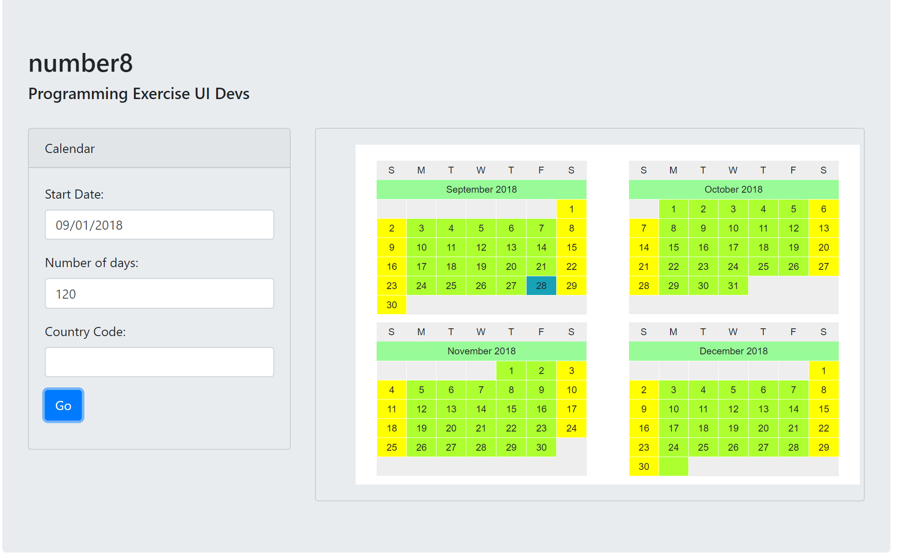

# Number8
> Technical code challenge

Render a calendar that spans as many weeks as necessary in order to cover the defined number of days

## Install
    $ git clone https://github.com/leo4all/calendar.git
    $ cd calendar
    $ npm install
    $ npm install -g browserify
    $ browserify main.js -o bundle.js

---

## Meta

Leonel Urbina – leonel.urbina.hn[at]gmail.com

Distributed under the MIT license. See ``LICENSE`` for more information.

[https://github.com/leo4all/calendar](https://github.com/leo4all/)

## Contributing

1. Fork it (<https://github.com/leo4all/calendar/fork>)
2. Create your feature branch (`git checkout -b feature/fooBar`)
3. Commit your changes (`git commit -am 'Add some fooBar'`)
4. Push to the branch (`git push origin feature/fooBar`)
5. Create a new Pull Request
